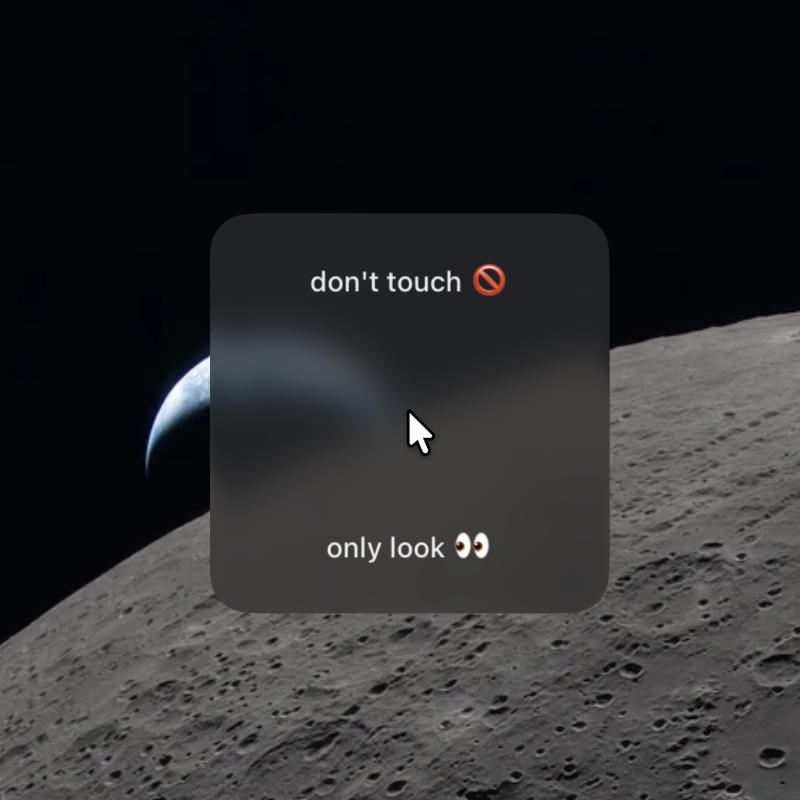

# BlockedBySquare

<p align="center"></p>

**Lock your Mac in style.** Block all input system-wide and wrap your cursor in a glowing glass square — because sometimes you just need the world to stop touching your keyboard.

**Perfect for when:**

- You're flexing 4 Claude terminals in parallel and _cannot_ let someone break your token chain combo
- Your cat has opinions about your planning session and types them directly into your terminal
- You stepped away for 30 seconds and came back to a Slack message you definitely did not send
- You just want people to know: this screen is occupied, this is intentional, and yes, it looks sick

**Activate lock mode → press ESC to lock the screen → sign back in.**

Locking the screen means only the Mac owner can resume — no passerby can just tap a key and keep going.

<p align="center"></p>

---

## What it does

- Sits quietly in the **menu bar** — zero Dock presence, zero distraction
- Activate with a **configurable keyboard shortcut** (default: ⌘⇧L) or via the menu bar
- Intercepts **all keyboard and mouse input** system-wide — nothing gets through while locked
- Renders a **glass-effect glowing square** that follows the cursor across all displays
- Shows **two short phrases** inside the square (fully customizable, with per-phrase font, color, and padding)
- Press **ESC** to lock the screen and return to idle — the app keeps running in the background

---

## Requirements

- macOS 13 Ventura or later
- Accessibility permission (required for system-wide input blocking)

---

## Installation

### Download (recommended)

Grab the latest `BlockedBySquare.app` from [Releases](../../releases).

### Build from source

```bash
git clone https://github.com/your-username/blocked_by_square
cd blocked_by_square
./bundle.sh
open BlockedBySquare.app
```

Requires Xcode command line tools (`xcode-select --install`).

---

## Usage

1. Launch `BlockedBySquare.app`
2. On first run, macOS will prompt for **Accessibility permission** — grant it in **System Settings → Privacy & Security → Accessibility**, then relaunch
3. A lock icon appears in the menu bar — the app is now running in the background
4. Press your activation shortcut (default **⌘⇧L**) or click **Lock Now** in the menu to enter lock mode
5. Press **ESC** to lock your Mac and return to idle

### Settings

Click the menu bar icon → **Settings…** to configure:

- **Activation shortcut** — click the field and press any modifier+key combo to record a new one; ESC cancels
- **Security level** — Max (ESC locks the screen) or Low (ESC just exits lock mode without locking)
- **Open at login** — launch BlockedBySquare automatically when you log in
- **Top / Bottom text** — phrases shown inside the glass square, with separate light/dark mode colors, font size, and padding controls; press ⌘⌃Space in the text field to open the emoji picker
- **Text opacity** — how opaque the text is (0–1)

All changes apply live — a small preview window appears below Settings so you can see exactly what the square will look like before you save.

---

## How it works

- **Input blocking** uses a `CGEvent` tap at session scope — every keystroke and click is swallowed before it reaches any app
- **Overlay windows** are borderless `NSWindow`s created per display on lock activation, sitting just below screen-saver level
- **Cursor tracking** runs at 60 Hz via a `Timer` poll — more reliable across monitors than `NSEvent` routing
- **The square** uses the native glass effect on macOS 26+ and `NSVisualEffectView` on older versions, with a white glow shadow either way
- **Screen lock** calls `SACLockScreenImmediate` from the private `login.framework`, falling back to injecting Ctrl+Cmd+Q if needed
- **Global shortcut** is monitored via `NSEvent.addGlobalMonitorForEvents` while idle, which observes events without blocking them

---

## Permissions

BlockedBySquare requires **Accessibility** access to install a system-wide event tap. Without it, macOS won't allow the app to intercept input from other processes.

If the app quits immediately on launch, open **System Settings → Privacy & Security → Accessibility** and make sure BlockedBySquare is enabled.

---

## License

MIT
