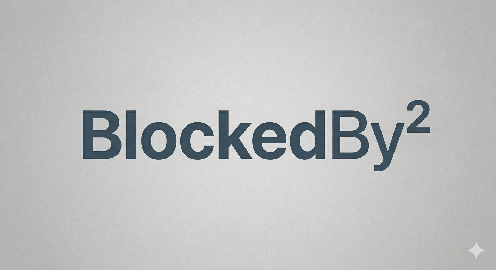

# BlockedBySquare



Lock your Mac in style.

BlockedBySquare lives in the menu bar and blocks all keyboard and mouse input on demand, wrapping your cursor in a glowing glass square so everyone knows the screen is intentionally locked. Press **ESC** to lock the screen and return the app to idle.

---

## What it does

- Sits quietly in the **menu bar** — zero Dock presence, zero distraction
- Activate lock mode with a **configurable keyboard shortcut** (default: ⌘⇧L) or via the menu bar
- Intercepts **all keyboard and mouse input** system-wide — nothing gets through while locked
- Renders a **glass-effect glowing square** that follows the cursor across all displays
- Optionally shows **two short phrases** inside the square (top half and bottom half)
- Press **ESC** to trigger a screen lock and return to idle — the app keeps running

---

## Requirements

- macOS 13 Ventura or later
- Accessibility permission (required for system-wide input blocking)

---

## Installation

### Download (recommended)

Grab the latest `BlockedBySquare.app` from [Releases](../../releases).

### Build from source

```bash
git clone https://github.com/your-username/blocked_by_square
cd blocked_by_square
./bundle.sh
open BlockedBySquare.app
```

Requires Xcode command line tools (`xcode-select --install`).

---

## Usage

1. Launch `BlockedBySquare.app`
2. On first run, macOS will prompt for **Accessibility permission** — grant it in **System Settings → Privacy & Security → Accessibility**, then relaunch
3. A lock icon appears in the menu bar — the app is now running in the background
4. Press your activation shortcut (default **⌘⇧L**) or click **Lock Now** in the menu bar to enter lock mode
5. Press **ESC** to lock your Mac and return to idle

### Settings

Click the menu bar icon → **Settings…** to configure:

- **Activation shortcut** — click the field and press any modifier+key combo to record a new shortcut; ESC cancels recording
- **Top phrase** — optional text shown in the upper half of the glass square
- **Bottom phrase** — optional text shown in the lower half of the glass square

---

## How it works

- **Input blocking** uses a `CGEvent` tap at session scope — every keystroke and mouse click is swallowed before it reaches any app
- **Overlay windows** are borderless `NSWindow`s created per display on lock activation, sitting just below screen-saver level
- **Cursor tracking** runs at 60 Hz via a `Timer` poll rather than `NSEvent` routing — more reliable across monitors
- **The square** is pure `CALayer` composition: a semi-transparent fill, a diagonal specular gradient, and a white glow shadow
- **Screen lock** calls `SACLockScreenImmediate` from the private `login.framework`, falling back to injecting Ctrl+Cmd+Q if needed
- **Global shortcut** is monitored via `NSEvent.addGlobalMonitorForEvents` when idle, which observes events without blocking them

---

## Permissions

BlockedBySquare requires **Accessibility** access to install a system-wide event tap. Without it, macOS won't allow the app to intercept input from other processes.

If the app quits immediately on launch, open **System Settings → Privacy & Security → Accessibility** and make sure BlockedBySquare is enabled.

---

## License

MIT
