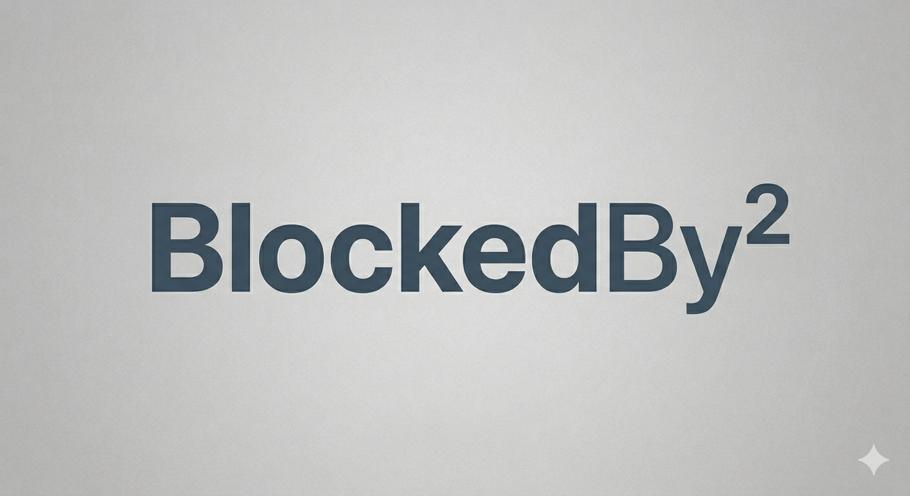

# BlockedBySquare

<p align="center"></p>

A tiny macOS menu-bar app that blocks all keyboard and mouse input system-wide and wraps your cursor in a glowing glass square. Look, but don't touch.

**→ [samuapps.dev/blocked-by-square](https://samuapps.dev/blocked-by-square/)**

## Download

Get the latest build from [Releases](https://github.com/samuthekid/blocked_by_square/releases/latest). The app is signed and notarized.

Requires macOS 13 or later and an Apple Silicon Mac (arm64 only).

## Use

1. Unzip the download and move `BlockedBySquare.app` to Applications.
2. Open it. Grant access in System Settings → Privacy & Security → Accessibility, then open it again.
3. Press ⌘⇧L (or choose Lock Now in the menu bar) to lock. Press ESC to release.

The default security mode is Max. In Max mode, ESC also locks your Mac. In Low mode, ESC only unblocks.

## Privacy

No data is collected and the app uses no network. See the [privacy policy](https://samuapps.dev/blocked-by-square/privacy.html).

## Build from source

```bash
git clone https://github.com/samuthekid/blocked_by_square
cd blocked_by_square
./bundle.sh --run
```

Requires Xcode command line tools (`xcode-select --install`). See [CLAUDE.md](CLAUDE.md) for build flags, internals, and the release process.

## License

MIT
